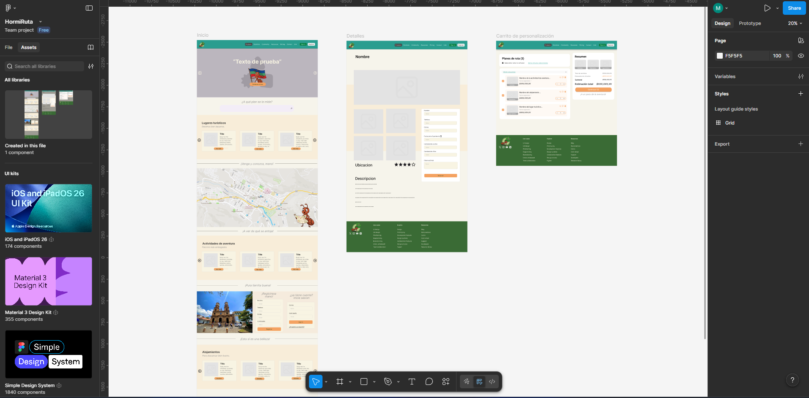

# Wireframes – HormiRuta Santandereana

Esta carpeta contiene los wireframes iniciales del proyecto.

El objetivo de estos diseños es definir la estructura visual y la experiencia
de usuario. Los wireframes son desarrollados de manera colaborativa utilizando Figma.

