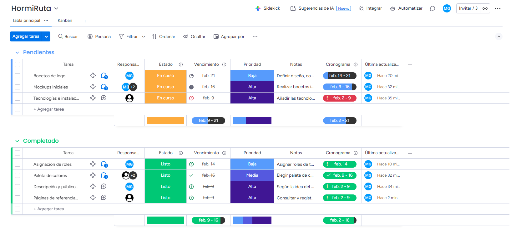

# HormiRuta Santandereana
## ¡Marcando un camino de experiencias, aventura y cultura!

## Descripción

HormiRuta Santandereana es una tienda virtual de servicios y experiencias turísticas enfocada en el municipio de San Gil - Santander, con proyección y escalabilidad provincial y departamental, promoviendo el aprendizaje sobre el entorno natural, cultural y turístico del territorio antes de la adquisición de los servicios.

La plataforma web presenta su catálogo de productos mediante un mapa interactivo, desde donde el usuario puede acceder a información, actividades disponibles y opciones de compra y reserva, utilizando a la hormiga culona como símbolo cultural y personaje guía en la exploración del territorio.

## Público objetivo

- Turistas nacionales e internacionales interesados en conocer San Gil y la tierra santandereana.
- Usuarios que buscan profundizar en el conocimiento del turismo, naturaleza, cultura y aventura de diferentes territorios.

## Integrantes

- Jefferson Arley Becerra Carreño
- María Paula Gómez Silva
- Angie Maria Moreno Mantilla

## Inspiraciones o referencias

### - Google Earth
[](https://earth.google.com/)
Plataforma de exploración geográfica de territorios de manera visual e intuitiva haciendo uso de mapas interactivos.

### - Visit Norway
[](https://www.visitnorway.com/)
Sitio oficial de turismo que presenta destinos turísticos combinando información cultural, natural y visual.

### - Culture Trip
[](https://theculturetrip.com/)
Plataforma digital que narra experiencias turísticas desde un enfoque cultural y educativo.

### - Tus Guías de Viaje
<a href="https://tusguiasdeviaje.com/mapa/">
  
</a>
Plataforma de exploración turística que presenta destinos y puntos de interés mediante mapas interactivos, sirviendo como referencia para la organización visual de experiencias, navegación por territorio y presentación de información turística.

### - Mapbox
[](https://www.mapbox.com/)
Plataforma de mapas interactivos con técnicas de implementación de mapas dinámicos, personalización visual y experiencia del usuario basada en geolocalización.

### - Google Maps
[](https://www.google.com/maps)
Aplicación de navegación mediante puntos de interés con visualización clara de rutas.

## Tecnologías utilizadas

### Control de versiones

- **Git** - Gestión del código fuente y colaboración en equipo

### Frontend


- **Node.js** - Entorno de ejecución JavaScript
- **Angular** - Framework web para desarrollo de aplicaciones SPA

### Backend


- **.NET** - Framework para desarrollo del API REST
- **C#** - Lenguaje de programación orientado a objetos

# Instalación y uso

## Prerrequisitos

Asegúrate de tener instalado lo siguiente:

### 1. **Git**

#### Windows:
1. Descarga el instalador desde [git-scm.com](https://git-scm.com/download/win)
2. Ejecuta el instalador descargado
3. Sigue el asistente de instalación (puedes dejar las opciones por defecto)
4. Verifica la instalación abriendo CMD o PowerShell y ejecutando:
   ```bash
   git --version
   ```

#### macOS:
1. Instala usando Homebrew (recomendado):
   ```bash
   brew install git
   ```
   O descarga el instalador desde [git-scm.com](https://git-scm.com/download/mac)

2. Verifica la instalación:
   ```bash
   git --version
   ```

#### Linux (Ubuntu/Debian):
```bash
sudo apt update
sudo apt install git
git --version
```

---

### 2. **Node.js** (versión 18 o superior)

#### Windows y macOS:
1. Descarga el instalador LTS desde [nodejs.org](https://nodejs.org/)
2. Ejecuta el instalador y sigue las instrucciones
3. Verifica la instalación:
   ```bash
   node --version
   npm --version
   ```

#### Linux (Ubuntu/Debian):
```bash
# Usando NodeSource para obtener la versión 18 o superior
curl -fsSL https://deb.nodesource.com/setup_18.x | sudo -E bash -
sudo apt-get install -y nodejs

# Verificar instalación
node --version
npm --version
```

#### Alternativa (Cualquier SO) - Usando NVM (Node Version Manager):
```bash
# Instalar NVM
curl -o- https://raw.githubusercontent.com/nvm-sh/nvm/v0.39.0/install.sh | bash

# Cerrar y abrir la terminal, luego:
nvm install 18
nvm use 18
```

---

### 3. **.NET SDK** (versión 6.0 o superior)

#### Windows:
1. Descarga el SDK desde [dotnet.microsoft.com](https://dotnet.microsoft.com/download)
2. Ejecuta el instalador
3. Verifica la instalación:
   ```bash
   dotnet --version
   ```

#### macOS:
```bash
# Usando Homebrew
brew install --cask dotnet-sdk

# O descarga desde dotnet.microsoft.com
```

Verifica la instalación:
```bash
dotnet --version
```

#### Linux (Ubuntu):
```bash
# Agregar el repositorio de Microsoft
wget https://packages.microsoft.com/config/ubuntu/$(lsb_release -rs)/packages-microsoft-prod.deb -O packages-microsoft-prod.deb
sudo dpkg -i packages-microsoft-prod.deb
rm packages-microsoft-prod.deb

# Instalar el SDK
sudo apt-get update
sudo apt-get install -y dotnet-sdk-8.0

# Verificar instalación
dotnet --version
```

---

### 4. **Angular CLI**

Una vez que Node.js y npm estén instalados, instala Angular CLI globalmente:

```bash
npm install -g @angular/cli
```

Verifica la instalación:
```bash
ng version
```

---

## Verificación de todos los prerrequisitos

Para asegurarte de que todo está correctamente instalado, ejecuta los siguientes comandos:

```bash
git --version
node --version
npm --version
dotnet --version
ng version
```

Todos los comandos deberían devolver sus respectivas versiones sin errores.

## Tablero sprint


## Notas Finales

### Herramientas para el Desarrollo

#### Editor Backend

- **Visual Studio** - IDE recomendado para el desarrollo del backend en .NET
- Abre la solución `.sln` ubicada en la carpeta `backend`
- Configura el proyecto de inicio y ejecuta con `F5`

#### Editor Frontend

- **Visual Studio Code** - Editor ligero y potente para el desarrollo del frontend en Angular
- Abre la carpeta `frontend` en VS Code
- Extensiones recomendadas:
  - Angular Language Service
  - ESLint
  - Prettier
- Ejecuta `ng serve` desde la terminal integrada

#### Testing de API

- **Postman** - Herramienta para pruebas y testing de endpoints de la API
- Importa la colección de endpoints (si está disponible)
- Configura las variables de entorno necesarias
- Prueba los endpoints del backend antes de integrar con el frontend

---

### 💡 Consejos Adicionales

- **Usa Git Branches**: Trabaja en ramas separadas para cada feature
- **Code Review**: Revisa el código antes de hacer merge a main
- **Testing**: Escribe pruebas unitarias para componentes críticos
- **Documentación**: Mantén actualizada la documentación de la API

---

<div align="center">
  <p>⭐ Si este proyecto te fue útil, considera darle una estrella ⭐</p>
  <p>Hecho con ❤️ y ☕</p>
</div>
